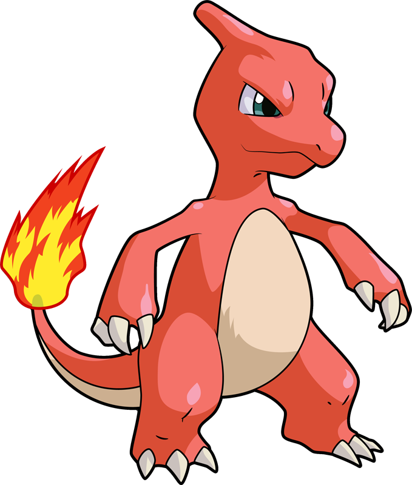
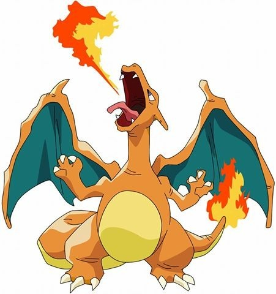
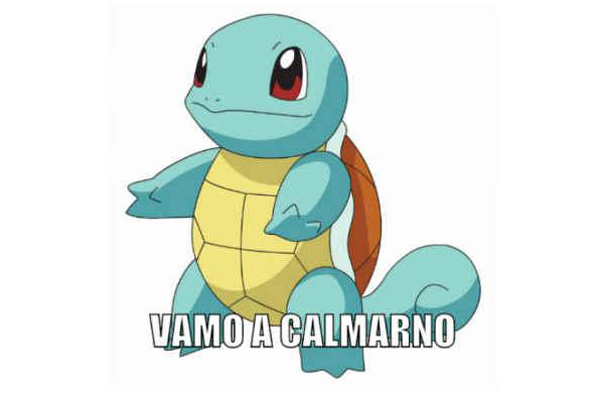
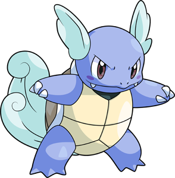

## Pokemon Dataset

We are going to explore the Pokemon database from [kaggle](https://www.kaggle.com/rounakbanik/pokemon)

```{r message=FALSE, warning=FALSE}
# install_packages("readr")
pokemon <- readr::read_csv("data/pokemon.csv")
```

### Exercises

{ width=100 }

Create a new variable in the dataframe called size, that takes values:
- `tiny` when the `weight_kg` is `smaller` than 10,
- `normal` when it is between 10 and 60,
- `large` when it is more than 60 and less than 100,
- `huge` when it is above 100

 Perform the operation without using the `case_when()` command.

```{r}
library(tidyverse)

size_cw <- pokemon %>%
  mutate(size = case_when(weight_kg < 10 ~ "Tiny",
                          weight_kg >= 10 & weight_kg < 60 ~ "Normal",
                          weight_kg >= 60 & weight_kg < 100 ~ "Large",
                          weight_kg >= 100 ~ "Huge")) %>%
  #group_by(size) %>%
  select(size, weight_kg)

size_ie <- pokemon %>% 
  mutate(size = if_else(weight_kg < 10,'Tiny',
                        if_else(weight_kg >= 10 & weight_kg < 60,"Normal",
                                if_else(weight_kg >= 60 & weight_kg < 100, "Large",
                                        'Huge')))) %>% 
    select(size, weight_kg)


table(size_cw$size==size_ie$size)
```

{ width=100 }

Get the average attack and defense points for each pokemon type (`type_1`).


```{r}
#
```

{ width=150 }

Calculate the average attack and defense points for all pokemon of generation 4 or higher, depending on whether they are legendary or not. Then, calculate the difference between attack and defense points for legendary and non-legendary pokemon.

```{r}
#
```

{ width=100 }     

Get the average percentage of female pokemons by generation

```{r}
#

```

{ width=100 }  

select: classfication,name,generation, and all variables that starts with 'against'. Then,
gather all variables that start with 'against' into a long format

```{r}
#
```


{ width=150 }  

