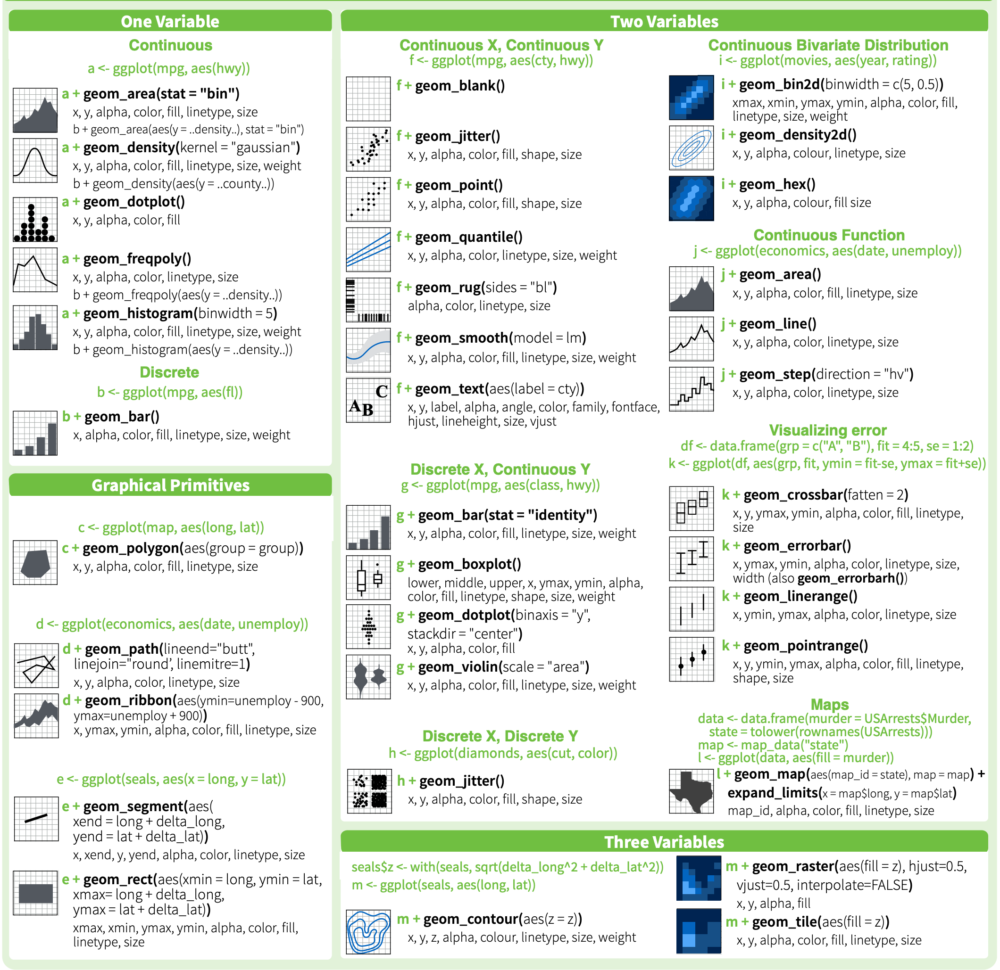

```{r setup, include=FALSE}
library(learnr)
library(tidyverse)
library(gapminder)
library(palmerpenguins)
library(countrycode)
library(ggrepel)
library(plotly)

tutorial_options(exercise.timelimit = 60)
knitr::opts_chunk$set(error = TRUE)
```

## Welcome

> To open this tutorial, go to the online link, or click on `|> run document`
`

In this tutorial, you will learn how to make visualizations in R, including:

* base plots in R 
* ggplot
* extensions to ggplot
* plotly

### Setup

As an example, we are going to use data from [https://www.gapminder.org/](https://www.gapminder.org/), a website that contains a number of social indicators. We are also going to use the package `gapminder` that includes some of the basic indicators in the website.

For some example we are also going to use [palmerpenguins](https://github.com/allisonhorst/palmerpenguins) data, from @palmerpenguins

I've preloaded the packages for this tutorial with 

```{r eval = FALSE}
library(tidyverse) # loads dplyr, ggplot2, and others
library(gapminder)
library(palmerpenguins)
library(countrycode)
library(ggrepel)
```

## Exploring the dataset


### Gapminder

```{r gapminder}
gapminder
```

We can see there's info for many countries & years on life expectancy, `lifeExp`, population, `pop`, and GDP per capita, `gdpPercap`

### Penguins

the Penguins data shows information on three types of penguins:

{width=350}
{width=350}

## basic plots in R


Rbase has some generic commands for plotting, which are adapted to the type of information you have, for example:

`plot` is a useful command, as many packages re-define what is going to show, based on the specific data type  (e.g.`igraph` for plotting networks.)

- With the expression `lifeExp ~ year` we say which variables we want to use
- `subset` allows to filter the dataset for a specific country. Try changing the country! 
- You can change the type of plot with the parameter `type`. Go ahead, try with the options  `"p", "l","b"`

```{r basic_plot_1, exercise = TRUE, exercise.eval = FALSE}
plot(formula= lifeExp ~ year, 
     data = gapminder, subset = country == "Cambodia",
     type='p')
```

to save a plot from Rbase, there is a number of device specific function, like `png()` and `pdf()`, you can check how they work with `?png()`.


## [ggplot2](http://ggplot2.tidyverse.org/reference/)


`ggplot` has its own syntax. The central idea is to think of plots as a succession of layers, which are built one at a time.    

- The __```+```__  operator allows us to add new layers to the plot.

- The ```ggplot()``` command allows us to define the __data source__ and the __variables__ that will determine the axes of the plot (x,y), as well as the color and shape of the lines or points, etc. 

- The successive layers allow us to define:
   
    - One or more types of graphics (geometries):
        - ```geom_col()```, 
        - ```geom_line()```
        - ```geom_point()```
        - ```geom_boxplot()```
    - titles and axis names ```labs()```
    - plot styling ```theme()```
    - axis scalses ```scale_y_continuous```,```scale_x_discrete``` 
    - facetting ```facet_wrap()```,```facet_grid()```

`ggplot` has __many__ commands, and it would not make any sense to try to learn them all by heart. It's useful to start with an old plot, or use the [cheatsheet](https://www.rstudio.com/wp-content/uploads/2016/11/ggplot2-cheatsheet-2.1.pdf).    


{width=800}

## Visual dimensions

This way of thinking about visualization allows us to rethink the different attributes as potential allies when displaying multidimensional information. For example:

- [```color = ```](http://www.stat.columbia.edu/~tzheng/files/Rcolor.pdf)
- ```fill = ```
- ```shape = ```
- ```size = ```
- ```alpha = ``` (saturation)
- ```facet_wrap()```

+ Those attributes we wan to use to _map_ a variable should go within the _aes_ ```aes(... color = variable)```
+ When we just want to improve the style, on a fixed way, they should be outside the _aes_ ```geom_col(color = 'green')```.


## Layer by layer {data-progressive=TRUE}

Let's build a simple plot, layer by layer.

### define the axes.

```{r penguins,exercise = TRUE, exercise.eval = FALSE}
ggplot(penguins, aes(x = flipper_length_mm,
                            y = body_mass_g))
```

### add the geometry

We can also define mapping variables for a specific geometry, using `aes()` within it.

```{r penguins1,exercise = TRUE, exercise.eval = FALSE}
ggplot(penguins, aes(x = flipper_length_mm,
                            y = body_mass_g)) +
  geom_point(aes(color = sex)) 
```

### facet the plot by species

```{r penguins2,exercise = TRUE, exercise.eval = FALSE}
ggplot(penguins, aes(x = flipper_length_mm,
                            y = body_mass_g)) +
  geom_point(aes(color = sex)) +
  facet_wrap(~species)

```

### add a preset theme

```{r penguins3, exercise = TRUE, exercise.eval = FALSE}
ggplot(penguins, aes(x = flipper_length_mm,
                            y = body_mass_g)) +
  geom_point(aes(color = sex)) +
  facet_wrap(~species) +
  theme_minimal() 
```

### define the colors manually

```{r penguins4, exercise = TRUE, exercise.eval = FALSE}
ggplot(penguins, aes(x = flipper_length_mm,
                            y = body_mass_g)) +
  geom_point(aes(color = sex)) +
  facet_wrap(~species) +
  theme_minimal() +
  scale_color_manual(values = c("darkorange","cyan4"), na.translate = FALSE)
```

### add titles and labels

```{r penguins5, exercise = TRUE, exercise.eval = FALSE}
ggplot(penguins, aes(x = flipper_length_mm,
                            y = body_mass_g)) +
  geom_point(aes(color = sex)) +
  facet_wrap(~species) +
  theme_minimal() +
  scale_color_manual(values = c("darkorange","cyan4"), na.translate = FALSE) +
  labs(title = "Penguin flipper and body mass",
       subtitle = "Dimensions for male and female Adelie, Chinstrap and Gentoo Penguins at Palmer Station LTER",
       x = "Flipper length (mm)",
       y = "Body mass (g)",
       color = "Penguin sex")
```

### add manual theme definitions

```{r penguins6, exercise = TRUE, exercise.eval = FALSE}
ggplot(penguins, aes(x = flipper_length_mm,
                            y = body_mass_g)) +
  geom_point(aes(color = sex)) +
  facet_wrap(~species) +
  theme_minimal() +
  scale_color_manual(values = c("darkorange","cyan4"), na.translate = FALSE) +
  labs(title = "Penguin flipper and body mass",
       subtitle = "Dimensions for male and female Adelie, Chinstrap and Gentoo Penguins at Palmer Station LTER",
       x = "Flipper length (mm)",
       y = "Body mass (g)",
       color = "Penguin sex") +
  theme(legend.position = "bottom",
        legend.background = element_rect(fill = "white", color = NA),
        plot.title.position = "plot",
        plot.caption = element_text(hjust = 0, face= "italic"),
        plot.caption.position = "plot")
```


##  [ggplot extensions](https://exts.ggplot2.tidyverse.org/gallery/).

The ggplot library in turn has many other libraries that extend its potential. Among my favorites are:


- [gganimate](https://gganimate.com/): for animated plots.
- [ggridge](https://cran.r-project.org/web/packages/ggridges/vignettes/introduction.html): for faceted density plots
- [ggally](https://ggobi.github.io/ggally/): for grids of plots and specific visualizations
- [treemapify](https://cran.r-project.org/web/packages/treemapify/vignettes/introduction-to-treemapify.html) for treemaps


for example

```{r message=FALSE, warning=FALSE}
library(GGally)

penguins %>% 
  select(species:bill_depth_mm) %>% 
ggpairs(mapping = aes(color = species))
```


```{r}
library(ggridges)

ggplot(penguins, aes(x = bill_length_mm, y = species, fill=species)) + 
  geom_density_ridges()
```


## Gapminder

Let's use the [Happiness score](http://gapm.io/dhapiscore_whr) from gapminder:

"This is the national average response to the question of life evaluations asking the following “Please imagine a ladder, with steps numbered from 0 at the bottom to 10 at the top. The top of the ladder represents the best possible life for you and the bottom of the ladder represents the worst possible life for you. On which step of the ladder would you say you personally feel you stand at this time?” This measure is also referred to as Cantril life ladder. Gapminder has converted this indicator's scale from 0 to 100 to easily communicate it in terms of percentage."


```{r}
whs <- read_csv('../data/hapiscore_whr.csv') %>% 
  pivot_longer(names_to = 'year', values_to = 'whs', cols = `2005`:`2019`) %>% 
  mutate(year = as.integer(year),
         country = as_factor(country),
         continent =  countrycode(sourcevar = country,
                            origin = "country.name",
                            destination = "continent")) %>% 
  filter(!is.na(whs)) %>%
  arrange(country,year)
```


```{r message=FALSE, warning=FALSE}
whs %>% 
ggplot(., aes(x = whs, y = continent, fill = continent))+
  geom_density_ridges(alpha = 0.75)+
  scale_fill_manual(values = continent_colors)
```


## using multiple geometries to prove a point

We can overlap multiple layers on a plot to highlight some result.

Here, for example, We want to emphasize the position of Luxembourg in in the index. For this, we can:

1. Plot each country as a point in a scatter plot, using `geom_point`
2. Plot the underlying distribution for each year, using `geom_violin`
3. Plot only Luxembourg with a stronger saturation. For this, we use again `geom_point`, but using a specific subset of the data
4. To make it clear that the red dot is Luxembourg, we label one of them, using 'geom_text_repel` from the [ggrepel package](https://cran.r-project.org/web/packages/ggrepel/vignettes/ggrepel.html) (this is actually an overkill, as ggrepel is design to label multiple points, not just one!)

```{r}
whs %>% 
  filter(year >= 2009) %>% 
ggplot(., aes(x = whs, y = factor(year)))+ 
  geom_point(alpha=0.75, aes(color = continent)) +
  geom_violin(alpha = 0.75)+
  geom_point(data = whs %>% filter(country=='Luxembourg'), color='red') + 
  geom_text_repel(data = whs %>% filter(country=='Luxembourg', year==2009),
                  aes(label=country), nudge_x = 0.1, nudge_y = 0.5)+
  labs(title = 'Position of Luxembourg in the distribution', x = 'Happines Score', y = 'year')+
  theme_minimal()
```

## Interactive visualizations

What if we want to see all countries?

Let's take for example 2007, and merge the data with the GDP per capita, to see if money and happiness are correlated. 

This plot looks awful! it is simply too much information for a single plot. If we would like to use it on a paper, we should, e.g. select which countries to show.

```{r  whs, exercise = TRUE, exercise.eval = FALSE, fig.width=8, fig.height=5}
whs %>% 
  left_join(gapminder_unfiltered, by = c("country", "year", "continent")) %>% 
    filter(year == 2007, !is.na(gdpPercap)) %>% 
  ggplot(., aes(x = whs, y = gdpPercap,color = continent))+ 
  geom_point(alpha=0.75) +
  geom_text_repel(aes(label=country))+
  labs(x = 'Happines Score', y = 'year')+
  theme_minimal() +
  theme(legend.position = 'bottom')
```

But we could also use an interactive plot and let the _user_ select what to see. For this, we are going to use [plotly](https://plotly.com/r/). This library translate our plots in R to interactive javascript plots. 

```{r}
g <- whs %>% 
  left_join(gapminder_unfiltered, by = c("country", "year", "continent")) %>% 
    filter(year == 2007, !is.na(gdpPercap)) %>% 
  ggplot(., aes(x = whs, y = gdpPercap, color = continent))+ 
  geom_point(alpha=0.75) +
  labs(x = 'Happines Score', y = 'GDP per capita')+
  theme_minimal()

ggplotly(g)
```

This is much more neat!

## Personalized tooltip

- But it doesn't show the country! to get this info, lets map it into some variable, like `label`
- What if we would like to map the size to the life expectancy?


```{r  plotly, exercise = TRUE, fig.width=8, fig.height=5}
g <- whs %>% 
  left_join(gapminder_unfiltered, by = c("country", "year", "continent")) %>% 
    filter(year == 2007, !is.na(gdpPercap)) %>% 
  ggplot(., aes(x = whs, y = gdpPercap, color = continent))+ 
  geom_point(alpha=0.75) +
  labs(x = 'Happines Score', y = 'GDP per capita')+
  theme_minimal()

ggplotly(g)
```


```{r plotly-solution, fig.width=8, fig.height=5}
g <- whs %>% 
  left_join(gapminder_unfiltered, by = c("country", "year", "continent")) %>% 
    filter(year == 2007, !is.na(gdpPercap)) %>% 
  ggplot(., aes(x = whs, y = gdpPercap, color = continent, label = country, size=lifeExp))+ 
  geom_point(alpha=0.75) +
  labs(x = 'Happines Score', y = 'GDP per capita')+
  theme_minimal()

ggplotly(g)
```


- We can also indicate plotly what variable from `aes` to show
- And use a new variable, i.e. `text` to paste the info the way we want.

```{r}
g <- whs %>% 
  left_join(gapminder_unfiltered, by = c("country", "year", "continent")) %>% 
    filter(year == 2007, !is.na(gdpPercap)) %>% 
  ggplot(., aes(x = whs, y = gdpPercap, color = continent, size=lifeExp, text = paste('Life Expectancy: ', scales::number(lifeExp, accuracy = 0.1), #let's show only one decimal
                                                                                      '<br>Country: ', country)))+ #<br> is html code for new line. 
  geom_point(alpha=0.75) +
  labs(x = 'Happines Score', y = 'GDP per capita')+
  theme_minimal()

ggplotly(g, tooltip = 'text')
```


