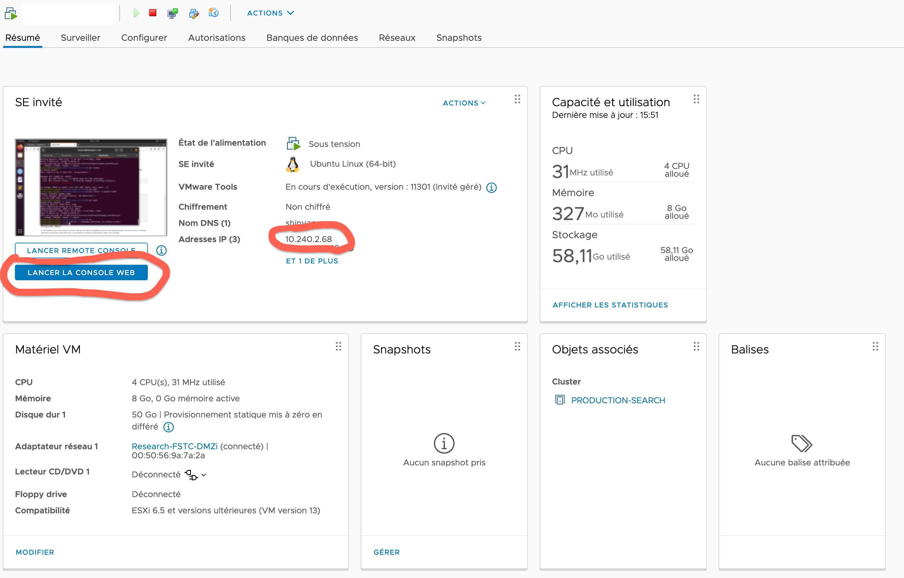

```{r setup, include=FALSE}
library(tufte)
# invalidate cache when the tufte version changes
knitr::opts_chunk$set(cache.extra = packageVersion('tufte'))
options(htmltools.dir.version = FALSE)
```

# Introduction

In this section we are going to see the necessary steps for the deployment of our shiny apps in a dedicated website.

Until now the shiny apps we developed were running on your computer. If you want to share them with other (potentially non-R speakers), it would be useful to host them on a server. There is a freemium server[^1] with a really easy deployment directly from your Rstudio. But the free version only allows 25 hours of use per month.

[^1]: <https://www.shinyapps.io/>

Fortunately, we can use the servers from the Uni Lu to host our apps. The idea is to have a Virtual Machine (VM) dedicated to the shinyapp, and access the app through the browser. In this way, you don't need to have your computer on and running it, and anyone with a web browser can access

We are going to see all the steps, from asking a VM... to asking a domain (but there is a lot *you* need to do besides asking!)

# 1. Request the VM:

First of all, we need to make a ticket for the VM[^2], and we need to fill the template for the request.

[^2]:  <https://service.uni.lu/> --\> IT --\> Server Provisioning (IT) --\> New virtual server (VM)

some tips for filling the template:

-   Is it a Test server (Y/N): **N**
-   Operating System (OS): **Ubuntu 20**
-   Number of CPUs: **2**
-   Memory (in GB): **8**
```{marginfigure} 
this of course depend on the app needs, but a small VM should be enough
```
-   Number of disks: **1**
-   Size of the different disks: **50Gb**
-   Port: **80**
-   Direction (In / Out): **Out**
-   Does this server needs to be backuped by Central Service? YES / NO : **NO**
-   Does this server require monitoring by Central Service (Solarwinds)? YES / NO: **NO**

# 2. Prepare the VM:


Once the ticket is processed, you will be answered with a link to the VM Client, where you can control the VM, and run a console for the configuration



You will also get the network information. You need to setup the network by editing `/etc/netplan/00-installer-config.yaml`. You can follow the tutorial by @Serverlab, but the people from IT is always very helpful with this!

## a) Setup the GUI (optional)

Installing a graphical user interface might not be the best option if you are experienced with the linux terminal, as this will consume part of the VM computational power. But if you do not feel too comfortable with the terminal, it is a good idea to install the GUI to simplify your work on the virtual machine.

For this, we can follow @Rendek2021Feb tutorial:

1.  First install `tasksel`

```{r, engine = 'bash', eval = FALSE}
sudo apt update
sudo apt install tasksel
```

2.  Then use `tasksel` to install the GUI

```{r, engine = 'bash', eval = FALSE}
sudo tasksel install ubuntu-desktop
```

3.  And finally, reboot

```{r, engine = 'bash', eval = FALSE}
reboot
```

## b) Install R/Rstudio

In principle, we only need R[^3] + shiny-server[^4] in order to serve our apps. But again, if you want to see a more familiar interface, you can also install Rstudio[^5]. This will let you easily test the app on the VM before deployment (and for debugging!)

[^3]: <https://cran.r-project.org/>

[^4]: <https://rstudio.com/products/shiny/shiny-server/>

[^5]: <https://rstudio.com/products/rstudio/>

We are going to follow @Rbloggers, a very useful step-by-step guide for the installation

```{r, engine = 'bash', eval = FALSE}
sudo apt-get update
sudo apt-get install r-base
```

## c) Install ubuntu dependencies

```{r, engine = 'bash', eval = FALSE}
sudo apt-get install -y libcurl4-openssl-dev 
sudo apt-get install -y libxml2-dev
```

## d) Install java

```{r, engine = 'bash', eval = FALSE}
sudo apt install default-jre
sudo apt install default-jdk
```

## e) Make .libpath accesible to shiny-server

This one is a little tricky. We need to make sure that the when we install a package, it will be reachable to the shiny-server.

For this, we need to edit the Renviron file. If you don't like to edit files from the terminal, you can also install @sublime.

```{r, engine = 'bash', eval = FALSE}
sudo nano /usr/lib/R/etc/Renviron
```

Uncomment the line with `R_LIBS_USER=${R_LIBS_USER-‘~/Library/R/4.0/library’}` and comment the one above. So around lines 51-52 you should have something like:

    #R_LIBS_USER=${R_LIBS_USER-'~/R/x86_64-pc-linux-gnu-library/4.0'}
    R_LIBS_USER=${R_LIBS_USER-'~/Library/R/4.0/library'}

and make the path readable for the shiny-server

```{r, engine = 'bash', eval = FALSE}
sudo chmod 777 /usr/lib/R/site-library
```

## f) Install needed pacakges

- You will at least need shiny, but most probably a set of other libraries (check those that your app uses). You can do this from Rstudio, or from the terminal. 

- Be sure that if you are asked if you want to create a personal directory, say **no**, so packages are saved in the folder created above.

# 3. Install shiny server

```{r, engine = 'bash', eval = FALSE}
sudo apt-get install gdebi-core
wget https://download3.rstudio.org/ubuntu-14.04/x86_64/shiny-server-1.5.16.958-amd64.deb
sudo gdebi shiny-server-1.5.16.958-amd64.deb
```

it's done! go to [localhost:3838](localhost:3838) and see the template app!


-   Now your apps live in `/srv/shiny-server/`. Adding an app is as simple as pasting a folder with the app.R file and all the other necessary files for the app to run (i.e. the data) in `/srv/shiny-server/`

-   Another useful folder is at `/var/log/shiny-server` where you will be able to see the logfile for each shinyapp running.

If you want to get a public domain for the app, we need to adjust the configuration so it fulfill the university requirements.

## Config file

We need to do edit the config file[^6] with the following:

[^6]: /etc/shiny-server/shiny-server.conf

1.  Change port of the shiny to 80. This makes the app accesible without expliciting the port (just the IP)
2.  Disable websocket with `disable_protocols websocket xdr-polling;`

The config file should look like this:

```{r, engine = 'bash', eval = FALSE}
# Instruct Shiny Server to run applications as the user "shiny"
run_as shiny;

# Define a server that listens on port 80
server {
  listen 80;

  disable_protocols websocket xdr-polling;

  # Define a location at the base URL
  location / {

    # Host the directory of Shiny Apps stored in this directory
    site_dir /srv/shiny-server;

    # Log all Shiny output to files in this directory
    log_dir /var/log/shiny-server;

    # When a user visits the base URL rather than a particular application,
    # an index of the applications available in this directory will be shown.
    directory_index on;
  }
}
```

# 4. Request the public domain

So now you have the app running on the IP of the VM[^7]. This is an internal IP, so it is only accesible through the eduroam network.

[^7]: you can check this on the VM website

If you want to request a public domain.uni.lu to show the app, you need to ask authorization from the communication Department[^8], and check the elegibility criteria[^9].

[^8]: [communication\@uni.lu](mailto:communication@uni.lu){.email}

[^9]: <https://daloos.uni.lu/>

> you can send the running app with the IP of the VM

# Practice

The on-site practice for this session is quite difficult, as we need to wait until our VM request is dealt with. Therefore this is for you to do as an after-course task.  

The __evaluation__ of this workshop is to build and deploy a shiny app with interactive visualizations. I encourage you to design a dashboard with your research results, so you can later use this! 

You will have two weeks to work on this project
> __deadline__: 9/07/2021

As this can be more or less challenging, depending on your background, let's set up a ladder of goals for the evaluation. You should send:

1. The internal IP of your VM, running your shiny app with the visualization and explanations^[don't ask for a public domain! wait until you have a publishable website for this]

2. If you could not setup the VM, create a user and upload the shiny to https://www.shinyapps.io/, and send me that link ^[remember this will be a public link, so don't put undisclosed results there!]

3.If you are still struggling with the above, put the shiny folder in moodle, or in a gitlab.uni.lu  repository

